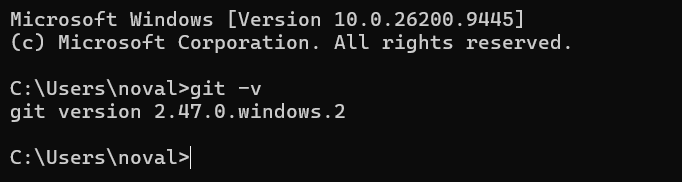
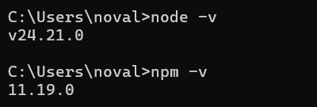
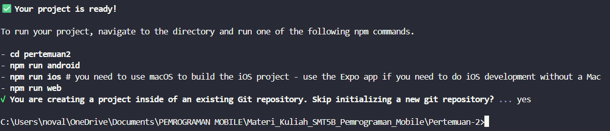
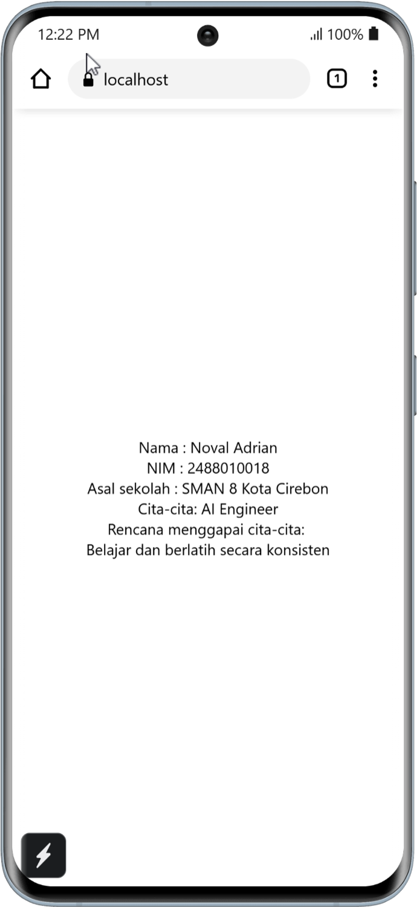

# 📱Praktikum Menyiapkan Lingkungan Pemngembangan dan Memulai Pemrograman Mobile(React Native)

## Tujuan pembelajaran

Mahasiswa mampu:

1. Menyiapkan lingkungan pengembangan dan memulai pemrograman mobile (React Native)
2. Membuat aplikasi mobile dengan React Native
3. Menyelesaikan tugas Cv sederhana dengan React Native

## Materi dan Laporan Praktikum

1. Menyiapkan lingkungan pengembangan dan memulai pemrograman mobile (React Native)
   - Memastikan instalasi Git bash
   - Cek instalasi Git bash (git --version)
   - Bukti verifikasi
     
   - Memastikan NodeJs dan NPM
     - Download dan install Node>js di https://nodejs.org/en/download
   - Kofirmasi Node.JS dan NPM (node -v, npm -v)
     

2. Membuat aplikasi / projek baru dengan React Native framework Expo Go
   - Buka dan baca dokumentasi resmi link https://expo.dev/go
   - Buka dan baca dokumentasi resmi link https://reactnative.dev/docs/getting-started
   - Memulai membuat project baru
   - Open Terminal Change directory ke Pertemuan 2
   - Masukkan perintah (npx create-expo-app ptmn2 --template blank)
   - Bukti Verifikasi
     
   - Running Projek
     - Cd ke pertemuan2
     - npx expo start
     - Install Expo Go di Android atau IOS
     - bisa juga menggunakan web emulator di laptop atau pc
     - Setelah berhentikan (ctrl + C)
     - Install (npx expo install react-dom react-native-web)
     - npx expo start --web
     - Konfirmasi keberhasilan
       

3. Tugas Praktikum
   - Membuat aplikasi CV sederhana dengan React Native
   - Nama Lengkap
   - NIM
   - Asal Sekolah
   - Cita-cita
   - Rencana menggapai cita-cita

Konfirmasi Keberhasilan
