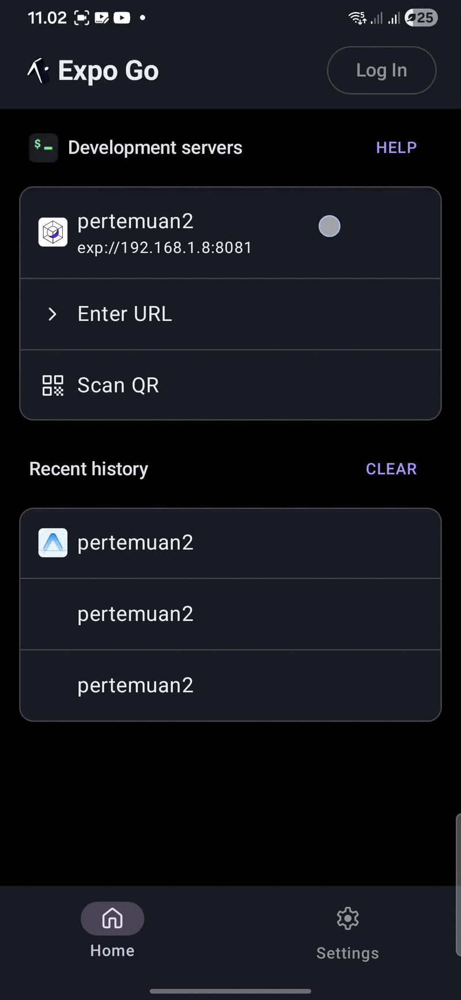

# Laporan Praktikum 3:
# Topik: Core Components & Styling — Studi Kasus Aplikasi CV

**Nama:** Noval Adrian  
**NIM:** 2488010018  
**Program Studi:** S1 Informatika — UIN Siber Syekh Nurjati Cirebon (UINSSC)

---

## 📝 LANGKAH 1 — Import & Struktur Dasar

```
1. Buka File App.js yang ada di folder proyek pertemuan2
2. Hapus seluruh isi file, lalu tambahkan import React dan useState dari 'react'
3. Import komponen-komponen inti dari 'react-native':
   - View, Text, Button, TextInput, FlatList, Image
   - ScrollView, TouchableOpacity, Pressable, Switch
   - Modal, ActivityIndicator, SafeAreaView, StyleSheet
   - Alert, Platform, SectionList, StatusBar
4. Buat fungsi App() kosong dengan return berisi View dan Text "Halo, Dunia!"
5. Export default fungsi App
```


---

## 📝 LANGKAH 2 — Menyiapkan Data (Objek & Array)

```
1. Buat konstanta PROFILE (objek JavaScript) di atas fungsi App():
   - Isi dengan data: name, title, email, phone, location, bio, avatar (URL foto)
2. Buat konstanta SKILL (array of objects) untuk FlatList:
   - Setiap item memiliki: id, name, level (persentase), color
   - Tambahkan minimal 6 keahlian dengan warna berbeda
3. Buat konstanta SECTION (array of sections) untuk SectionList:
   - Struktur: [{ title: "...", data: [...] }]
   - Isi dengan data Pendidikan (Education)
4. Buat konstanta SOCIAL (array) untuk tombol media sosial:
   - Setiap item memiliki: id, label, icon (emoji), url
```

---

## 📝 LANGKAH 3 — Sub-Components (SkillCard & TimelineCard)

```
1. Buat komponen SkillCard di atas fungsi App():
   - Menerima props: { item }
   - Tampilkan nama skill dan persentase level menggunakan Text
   - Buat progress bar menggunakan dua View bertumpuk (progressBg & progressFill)
   - Width progressFill menggunakan template literal: width: `${item.level}%`
   - backgroundColor progressFill menggunakan item.color
2. Buat komponen TimelineCard di atas fungsi App():
   - Menerima props: { item, onPress }
   - Gunakan TouchableOpacity dengan activeOpacity={0.75}
   - Tampilkan dot bulat (timelineDot), lalu konten: role, institution, period
   - Tambahkan teks hint "Ketuk untuk detail" di bawah
```
---

## 📝 LANGKAH 4 — State Management dengan useState

```
1. Di dalam fungsi App(), tambahkan state berikut dengan useState:
   - openToWork (boolean, default: true) → toggle Open to Work
   - selectedItem (object, default: null) → item yang dipilih di modal
   - modalVisible (boolean, default: false) → kontrol tampil/sembunyi modal
   - senderName (string, default: '') → nilai input nama pengirim
   - message (string, default: '') → nilai input pesan
   - sending (boolean, default: false) → status loading pengiriman
   - pressing (boolean, default: false) → status tekan tombol download
2. Buat fungsi handleCardPress(item):
   - Simpan item ke selectedItem
   - Set modalVisible menjadi true
3. Buat fungsi handleSend():
   - Validasi: jika senderName atau message kosong → Alert error
   - Set sending ke true
   - Setelah 2000ms: reset form, set sending ke false, tampilkan Alert sukses
```
---

## 📝 LANGKAH 5 — SafeAreaView, StatusBar & Header

```
1. Ganti seluruh isi return() di App() dengan struktur baru
2. Gunakan <SafeAreaView style={styles.safeArea}> sebagai wrapper paling luar
3. Tambahkan <StatusBar barStyle="light-content" backgroundColor="#1a1a2e" />
4. Buat View header (styles.headerBar) yang berisi:
   - Text "Curriculum Vitae" (styles.headerTitle)
   - View switchRow yang berisi:
     * Text label "Open" atau "Busy" sesuai state openToWork
     * Komponen Switch dengan value={openToWork} dan onValueChange={setOpenToWork}
     * Atur trackColor dan thumbColor pada Switch
```

---

## 📝 LANGKAH 6 — ScrollView & Profil Section (View, Text, Image)

```
1. Di bawah View header, tambahkan <ScrollView style={styles.scroll}>
2. Di dalam ScrollView, buat View profileSection yang berisi:
   a. <Image source={{ uri: PROFILE.avatar }} style={styles.avatar} />
   b. Tampilkan badge "Open to Work" secara kondisional (openToWork && ...)
   c. Text nama: PROFILE.name
   d. Text jabatan: PROFILE.title
   e. Text bio: PROFILE.bio
   f. View contactRow berisi email dan lokasi
   g. Text nomor telepon
   h. View socialRow: mapping SOCIAL → TouchableOpacity per item
      - Onpress: Alert.alert('Link', s.url)
   i. Pressable tombol "Download CV (PDF)":
      - style menggunakan fungsi callback: ({ pressed }) => [...]
      - onPressIn: setPressing(true), onPressOut: setPressing(false)
      - Text berubah saat pressing: "Mengunduh..." atau "Download CV (PDF)"
```
---

## 📝 LANGKAH 7 — FlatList (Daftar Skills)

```
1. Di dalam ScrollView, setelah View profileSection, tambahkan View sectionBox
2. Di dalam sectionBox:
   a. Tambahkan Text judul "Keahlian" (styles.sectionTitle)
   b. Tambahkan Text subtitle penjelasan (styles.sectionSubtitle)
   c. Tambahkan komponen FlatList dengan props:
      - data={SKILL}
      - keyExtractor={(item) => item.id.toString()}
      - renderItem={({ item }) => <SkillCard item={item} />}
      - scrollEnabled={false} (agar tidak konflik dengan ScrollView parent)
      - ItemSeparatorComponent: View dengan height 8
```
---

## 📝 LANGKAH 8 — SectionList (Riwayat Pendidikan & Pengalaman)

```
1. Di dalam ScrollView, setelah section Skills, tambahkan View sectionBox baru
2. Di dalam sectionBox:
   a. Tambahkan Text judul "Riwayat" (styles.sectionTitle)
   b. Tambahkan Text subtitle penjelasan (styles.sectionSubtitle)
   c. Tambahkan komponen SectionList dengan props:
      - sections={SECTION}
      - keyExtractor={(item) => item.id}
      - renderItem: render <TimelineCard item={item} onPress={handleCardPress} />
      - renderSectionHeader: View sectionHeader berisi Text nama section
      - scrollEnabled={false}
      - ItemSeparatorComponent: View height 10
      - SectionSeparatorComponent: View height 16
3. Perbedaan FlatList vs SectionList:
   - FlatList: data={array} → list seragam
   - SectionList: sections={[{title, data}]} → list berkelompok
```
---

## 📝 LANGKAH 9 — TextInput, Button & ActivityIndicator (Form Kontak)

```
1. Di dalam ScrollView, setelah section Riwayat, tambahkan View sectionBox baru
2. Di dalam sectionBox:
   a. Tambahkan Text judul "Hubungi Saya" dan subtitle penjelasan
   b. Tambahkan TextInput pertama (nama):
      - value={senderName}, onChangeText={setSenderName}
      - placeholder="Nama Anda", placeholderTextColor="#888"
      - editable={!sending}
   c. Tambahkan TextInput kedua (pesan):
      - value={message}, onChangeText={setMessage}
      - multiline={true}, numberOfLines={4}
      - style={[styles.textInput, styles.textArea]}
      - editable={!sending}
   d. Tampilkan kondisional:
      - Jika sending=true: View loadingRow berisi ActivityIndicator + Text
      - Jika sending=false: Button "Kirim Pesan" dengan onPress={handleSend}
```

---

## 📝 LANGKAH 10 — Modal (Popup Detail Riwayat)

```
1. Setelah penutup </ScrollView> dan sebelum </SafeAreaView>, tambahkan Modal
2. Konfigurasi Modal:
   - visible={modalVisible}
   - animationType="slide"
   - transparent={true}
   - onRequestClose={() => setModalVisible(false)}
3. Di dalam Modal, buat View modalOverlay (flex:1, background transparan gelap):
   a. Di dalamnya buat View modalBox (muncul dari bawah layar)
   b. Tampilkan data selectedItem secara kondisional (selectedItem && ...):
      - Text: selectedItem.role
      - Text: selectedItem.institution
      - Text: selectedItem.period
      - View garis pemisah (modalDivider)
      - Text: selectedItem.desc
   c. Tambahkan TouchableOpacity "✕ Tutup" → onPress: setModalVisible(false)
```

---

## 📝 LANGKAH 11 — StyleSheet (Styling Terpusat)

```
1. Di bawah fungsi App(), buat konstanta COLORS berisi palet warna terpusat:
   - bg, card, cardBorder, accent, accentLight, accentGold
   - text, textMuted, textDim, success, white
2. Buat objek styles menggunakan StyleSheet.create({...}):
   a. safeArea: flex 1, backgroundColor dari COLORS.bg
   b. scroll: flex 1
   c. headerBar: flexDirection row, backgroundColor gelap, padding, shadow
   d. profileSection: alignItems center, padding, backgroundColor card
   e. avatar: width/height 110, borderRadius 55, borderColor accent
   f. badge: backgroundColor hijau gelap, borderColor success
   g. sectionBox: marginHorizontal, backgroundColor card, borderRadius 16
   h. skillCard, skillHeader, progressBg, progressFill
   i. timelineCard, timelineDot, timelineContent
   j. textInput, textArea: dengan Platform.OS untuk padding berbeda iOS/Android
   k. loadingRow: flexDirection row, alignItems center
   l. modalOverlay: flex 1, backgroundColor rgba(0,0,0,0.75), justifyContent flex-end
   m. modalBox: backgroundColor, borderTopRadius, padding, borderTopWidth
3. Manfaat StyleSheet.create():
   - Kode lebih terorganisir dan mudah di-maintain
   - Performa lebih baik dibanding inline style
   - Mendukung pengecekan kesalahan properti (typo detection)
```

---

## ✅ LANGKAH 12 — Verifikasi & Pengujian

```
Jalankan aplikasi dengan: npx expo start
Lalu scan QR Code dengan Expo Go di smartphone
Uji semua fitur berikut:

1. Aplikasi bisa dibuka tanpa error → Layar CV tampil sempurna
2. Foto profil dari URL → Gambar berhasil termuat
3. Toggle Switch → Badge "Open to Work" muncul/hilang, label berubah
4. Scroll layar → Semua section Skills, Riwayat, Form bisa diakses
5. Progress bar skill → Bar berwarna terisi sesuai persentase
6. Ketuk kartu riwayat → Modal popup muncul dari bawah
7. Tombol "✕ Tutup" di Modal → Modal tertutup
8. Isi form dengan data valid → Loading 2 detik → Alert sukses
9. Kirim form dengan input kosong → Alert peringatan muncul
10. Tekan "Download CV" → Efek visual berubah (pressing) + Alert muncul
11. Tap tombol sosial media → Alert URL muncul
```



---

